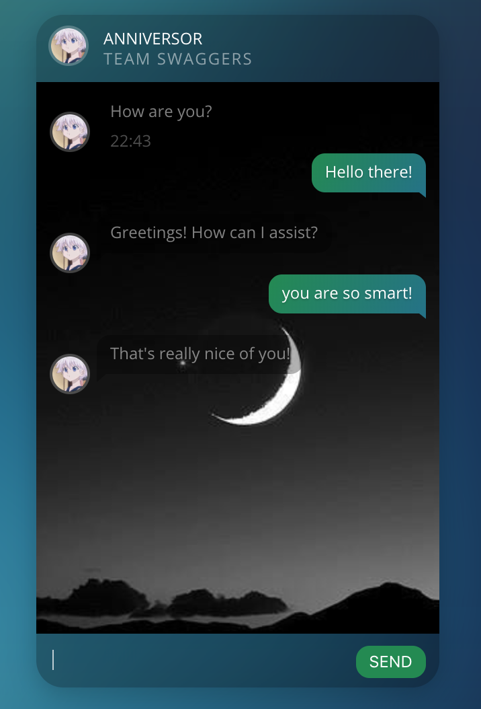
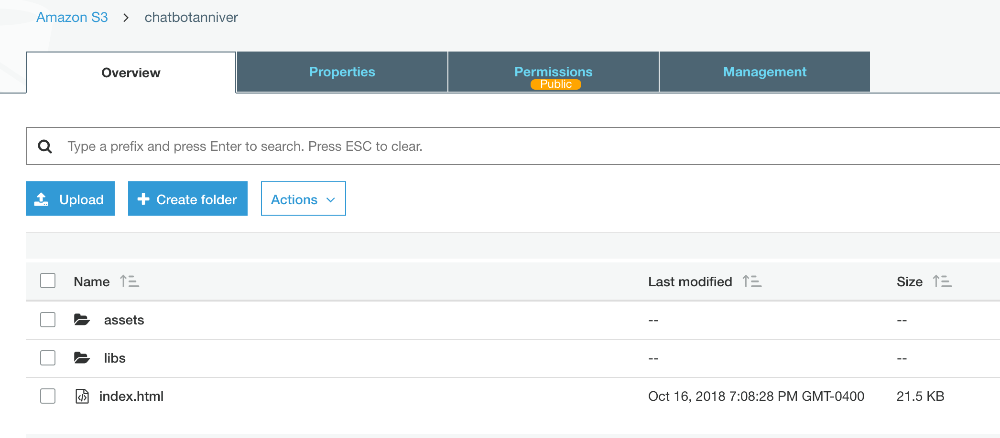
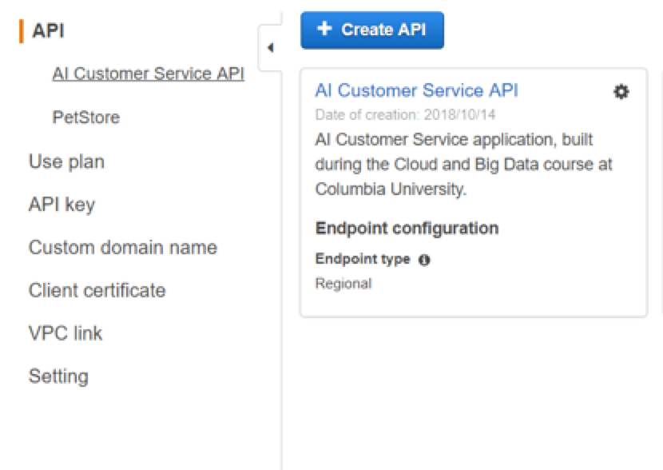
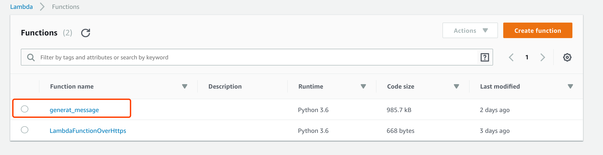
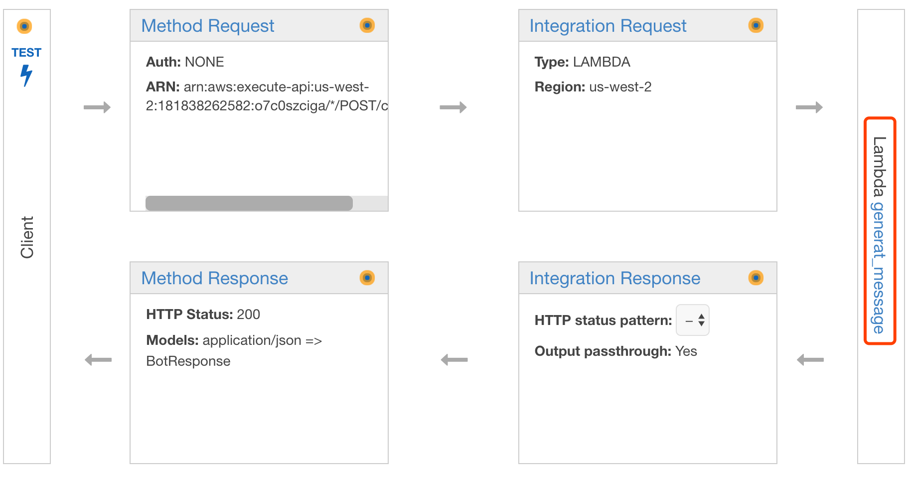
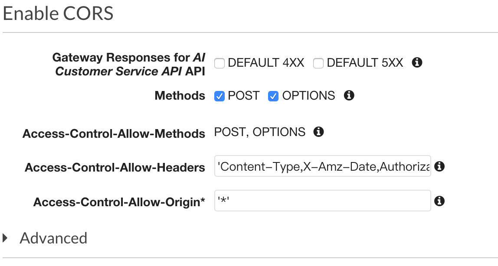
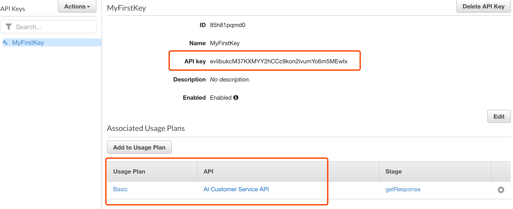
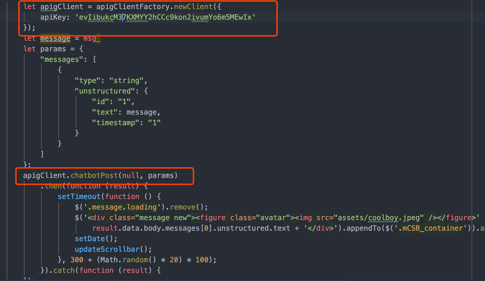

# HW1: Chatbot

## Author

Haoyu Yan, hy2574
Yuxuan Zhang, yz3377

## Frontend in S3
The endpoint for this project is: http://chatbotanniver.s3-website-us-west-2.amazonaws.com
Frontend:
Develop a user interface using JavaScript, CSS and Html. 

Host the whole frontend into an AWS S3 bucket

And then host the static website index.html. 
The endpoint for this project is: http://chatbotanniver.s3-website-us-west-2.amazonaws.com, which can be viewed in attributes of the bucket.

## Backend
Backend:
Import the swagger file into API gateway

Create a lambda function for post method in the API which is **Generat_message** function for our case.

And then incorporate the lambda function into post method to perform the chat operation:

Also, enable CORS on our API methods by enable CORS for methods and create the option method 

Setup the API key for the API by adding new API key and use plan for the API:

Generate SDK for our API, in our case, we choose JavaScript as our platform. And then move the zip file which is the package of SDK to the frontend project. Then follow the readme file in the SDK package to use the SDK in our project, and update the Frontend to call the API using the API key above.

